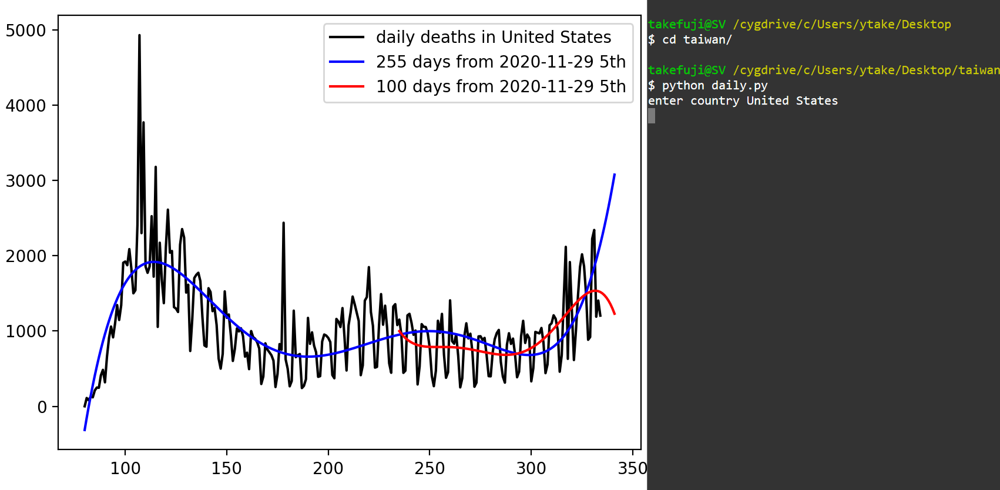

# Exercises for machine learning

# 1. Sweden prediction using curve-fitting
<a href='https://github.com/ytakefuji/sweden'> Sweden prediction</a>

Use numpy.polyfit function for prediction.

Hints: np.polyfit(x,y,z) where x and y are input and output with the zth degree of polinomial.

$ python swedendaily.py

# 2. Prediction for any country using the curve-fitting

Make a program for prediction by entering a country name.

$ python daily.py

# 3. Europe prediction using curve-fitting

You should convert euro.xlsx to euro.csv where euro.xlsx was downloaded from:
https://www.statista.com/statistics/1102288/coronavirus-deaths-development-europe/

Note that all integers must be converted to proper integers, for example, "1,234" to 1234 in euro.csv file.

Use numpy.polyfit function for prediction using converted euro.csv.

# 4. Titanic binary classification

<pre>
pandas, preprocessing, and train_test_split functions are detailed.
all strings must be converted into numbers for machine learning.
</pre>

https://github.com/ytakefuji/titanic

# 5. diabetes binary classification

<a href='http://archive.ics.uci.edu/ml/datasets/Early+stage+diabetes+risk+prediction+dataset.'> click-data</a>

Code your program for predicting binary detection.

You should check the content of diabetes_data_upload.csv before coding.

# 6. wine quality classification

http://archive.ics.uci.edu/ml/machine-learning-databases/wine-quality/

Code your program for predicting quality of red wine with regression.

You should check the content of winequality-red.csv before coding.

# 7. CDOT regression with data augmentation

https://github.com/ytakefuji/cdot

# 8. ML5 posenet for recognition of human body

https://github.com/ytakefuji/ml5

Demo site:
https://gpu.dob.jp/nosePos/index.html

Download a rednose.tar file and expand it.

Run the program by clicking index.html

Run simple_pose.py

Run yolo.py
<pre>
Create a program to identify a part of body and the screen location which can be used for switching on or off.
If the body part is within the certain area, turn on, else turn off.
</pre>

# 9. ensemble ensemble

https://github.com/ytakefuji/concrete
<pre>
Stacking, voting, Stacking+NN... are explained.
</pre>

